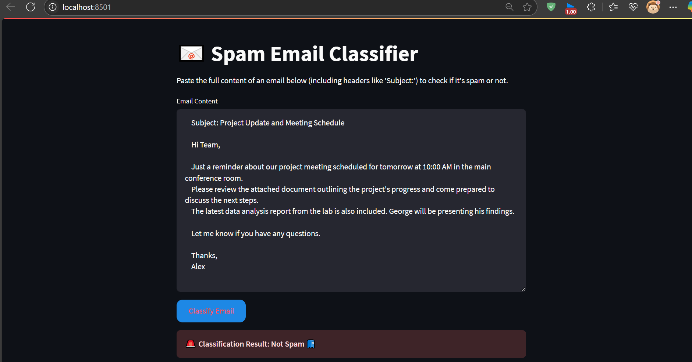
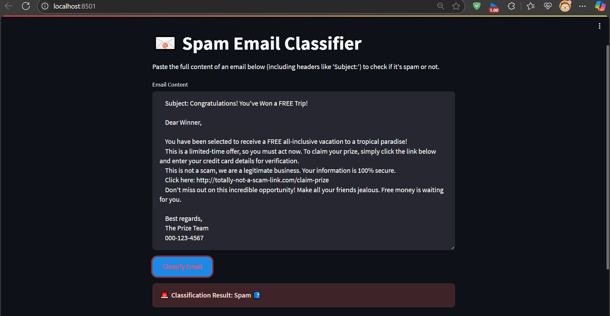

# Spam Email Classifier

This project uses machine learning to classify emails as "Spam" or "Not Spam" based on their content. The model is trained on the classic Spambase dataset from the UCI Machine Learning Repository and is deployed as a simple, interactive web application using Streamlit.

## 📸 Screenshots

Here’s a look at the web application interface:


**"Not Spam" Result**


**"Spam" Result**



## 📋 Features

- **Exploratory Data Analysis (EDA):** Visualizations to understand the characteristics of spam vs. non-spam emails.
- **Model Training & Comparison:** Trains and evaluates four different classification models (Logistic Regression, Naive Bayes, SVM, and Random Forest).
- **Model Persistence:** The best-performing model (Random Forest) and the data scaler are saved for future use.
- **Real-time Classification:** A command-line script (`test.py`) to classify raw email text.
- **Interactive Web UI:** A user-friendly web application (`app.py`) built with Streamlit for easy email classification.

## 💾 Dataset

The project uses the **Spambase Data Set** from the UCI Machine Learning Repository. This dataset consists of 4601 emails, each represented by 57 continuous attributes (features) and a class label indicating whether the email is spam (1) or not spam (0).

- **Link to Dataset:** [https://archive.ics.uci.edu/dataset/94/spambase](https://archive.ics.uci.edu/dataset/94/spambase)

## 📂 Project Structure

The repository contains the following key files:

- **`data_visulaize.ipynb`**: A Jupyter Notebook for performing exploratory data analysis and visualizing the dataset.
- **`training.ipynb`**: A Jupyter Notebook that handles data preprocessing, model training, evaluation, and saving the final model artifacts.
- **`test.py`**: A Python script to test the trained model from the command line by classifying sample email text.
- **`app.py`**: The main Streamlit application file that provides the web user interface for classifying emails.
- **`requirements.txt`**: A file listing all the Python libraries required to run the project.
- **`/models`**: This folder contains the saved model (`spam_classifier_rf.joblib`), the scaler (`scaler.joblib`), and the feature names (`feature_names.joblib`).

## ⚙️ Setup and Installation

To run this project locally, please follow these steps:

1.  **Clone the repository:**
    ```bash
    git clone <your-repository-url>
    cd <your-repository-folder>
    ```

2.  **Create and activate a virtual environment:**
    ```bash
    # For Windows
    python -m venv venv
    .\venv\Scripts\activate

    # For macOS/Linux
    python3 -m venv venv
    source venv/bin/activate
    ```

3.  **Install the required libraries:**
    ```bash
    pip install -r requirements.txt
    ```

## 🚀 Usage

Once the setup is complete, you can run the Streamlit web application:

1.  Open your terminal and navigate to the project's root directory.
2.  Ensure your virtual environment is activated.
3.  Run the following command:
    ```bash
    streamlit run app.py
    ```
4.  The application will open in a new tab in your web browser. Paste any email content into the text area and click "Classify Email" to see the result.

## 🤖 Model Performance

The **Random Forest Classifier** was selected as the final model due to its superior performance across all metrics.

- **Accuracy:** ~94.5%
- **Precision (Spam):** ~95%
- **Recall (Spam):** ~91%
- **F1-Score (Spam):** ~93%

The model demonstrates a strong ability to correctly identify spam while maintaining a low rate of false positives.

## 💡 Future Improvements

- **Use a More Modern Dataset:** The Spambase dataset is from the late 90s. Training on a more recent dataset could improve accuracy on modern spam.
- **Advanced Feature Extraction:** Implement more sophisticated text processing techniques like TF-IDF or word embeddings (e.g., Word2Vec, GloVe) to better capture the context of words.